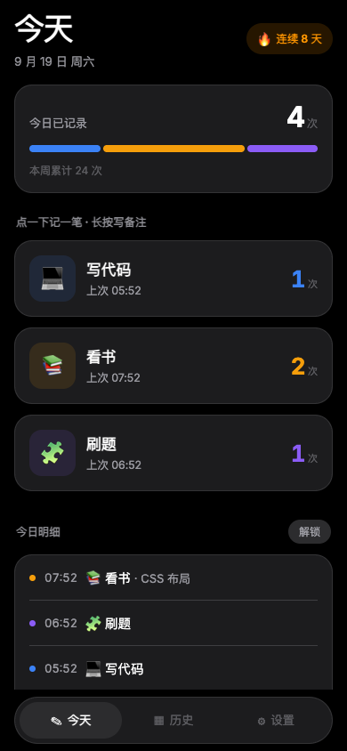
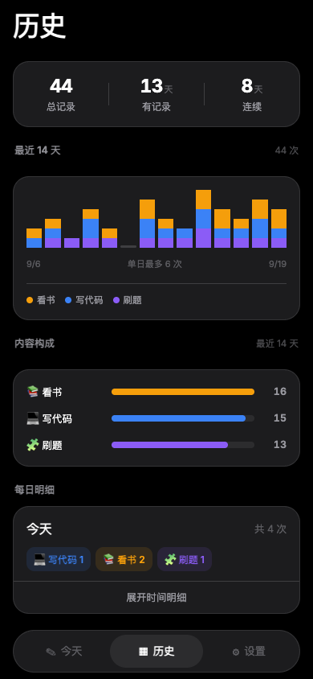
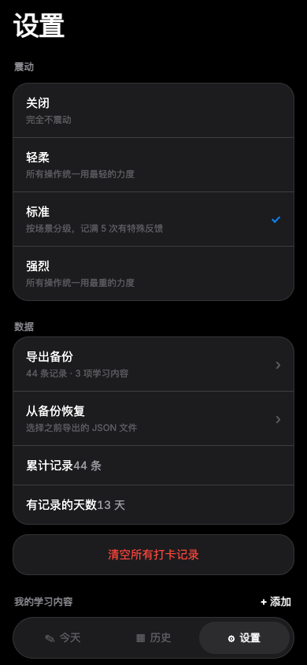

# Tally

> 一个极简的个人学习记录 App —— **点一下，记一笔**。
>
> 不打卡、不计时、不弹提醒。你只需要在学完一样东西之后，按下对应的大按钮。

<!-- 截图 -->
<p align="center">
  
  &nbsp;&nbsp;
  
  &nbsp;&nbsp;
  
</p>

---

## 为什么做这个

大部分记录工具都太重了：要选分类、填时长、写备注、设提醒，坚持三天就放弃。

这个 App 反过来 —— **记录这个动作本身不应该是负担**。想记「今天刷了两道题」，解锁手机 → 点一下 → 完事。整个过程不到两秒，全程有震动反馈，不用看屏幕。

## 亮点

### 🎯 点一下 = 记一笔

三个（或五个、七个）大按钮，按下去就追加一条带时间戳的记录。

- 有**震动反馈**，而且分场景：记录是轻震，当天记到第 5 次会给你一个「成功」提示音的震动
- 有 `+1` 上浮动画，手感和视觉都确认「记上了」
- **长按按钮**可以顺手写一句备注（「调通了登录接口」），不写也行

### 🧩 学习内容完全自定义

这一项是这个项目的核心设计。**没有任何写死的分类** —— 学什么由你定，改起来有两个入口：

**方式一：改配置文件**（推荐，干净、可版本控制）

编辑 `src/config/activities.local.ts`（不存在的话，跑一次 `npm install` 会自动生成）：

```ts
export const LOCAL_ACTIVITIES: Activity[] = [
  { id: 'code',     label: '写代码', emoji: '💻', color: '#3B82F6' },
  { id: 'read',     label: '看书',   emoji: '📚', color: '#F59E0B' },
  { id: 'practice', label: '刷题',   emoji: '🧩', color: '#8B5CF6' },
];
```

> `id` 定了就别改 —— 它是记录关联的键，改了会导致已有记录对不上。

**方式二：在 App 内改**

设置页 → 长按条目可以**拖拽排序**，点「编辑」可以改名字、从 24 个图标里挑、从 12 个颜色里选，全部实时预览。

### 🔒 你的个人配置不会进版本库

这是为「开源 + 个人使用」两种场景同时设计的：

```
src/config/
├── activities.example.ts   ← 提交到仓库，3 项演示数据（模板）
└── activities.local.ts     ← 已被 .gitignore 忽略，你的私人配置
```

别人 `clone` 之后 `npm install` 会自动触发 `postinstall`，从示例文件生成一份属于他自己的 `activities.local.ts`，开箱即跑 —— 而你的个人配置永远不会出现在公开仓库里。

### 📊 历史不止是流水账

历史页提供三种视角：

| 视图 | 说明 |
|---|---|
| **近 14 天趋势** | 柱状图，每根柱子按学习内容**堆叠着色**，一眼看出最近投入的分布和节奏 |
| **内容构成** | 横向条形图，最近 14 天各内容占比排序 |
| **每日明细** | 按天分组的卡片，点开看当天每条记录的具体时间与备注 |

顶部还有 `总记录 / 有记录天数 / 连续天数` 三个统计。

### 💾 数据完全在你自己手里

- **全本地存储**，不需要账号、不需要联网、没有服务器
- **支持导出 / 导入 JSON 备份** —— 换手机或重装前导出一次，随时恢复
- 导入采用**合并**策略，不会覆盖已有记录

### 🪶 只有 13 MB

Release APK 通过三项优化压到 13 MB（React Native 应用的体积下限通常在 15 MB 以上）：

| 措施 | 效果 |
|---|---|
| 只打包 `arm64-v8a` 单架构 | 砍掉 3/4 的原生库，降幅最大 |
| R8 代码混淆 + 资源裁剪 | 删掉未被引用的代码与资源 |
| 原生库压缩打包 | `.so` 以压缩形式存放在 APK 内 |

### 🌙 纯粹的深色界面

没有主题切换、没有浅色模式。深色是从一开始就定死的设计选择 —— 单色底 + 高饱和内容色的对比度更好，也少了一整套需要维护的色板。

## 快速开始

需要 Node.js 18+。

```bash
git clone https://github.com/david-dev666/tally.git
cd tally
npm install          # 会自动生成你的 activities.local.ts
npm start            # 手机装 Expo Go 扫码即可运行
```

第一次运行后，编辑 `src/config/activities.local.ts` 换成你自己的学习内容，重启 App 生效。

### 在电脑上预览

```bash
npm run web
```

## 打包成 APK

项目已经准备好完整的本地构建流程。

**前置环境**（macOS）：

```bash
brew install openjdk@17
brew install --cask android-commandlinetools
# 然后设置 JAVA_HOME 与 ANDROID_HOME 环境变量
```

**构建**：

```bash
npm run build:apk      # 产出 app-release.apk
npm run release:apk    # 构建并通过 USB 直接装到手机
```

产物在：

```
android/app/build/outputs/apk/release/app-release.apk
```

`build:apk` 会自动把 `versionCode` 加 1（`scripts/bump-version.js`），你不需要手动管版本号。语义版本 `versionName`（`1.0.0`）仍由你手动维护。

> ⚠️ 如果你改了**原生相关配置**（`app.json` 里的图标、`userInterfaceStyle`、plugins 等），需要额外跑一次 `npm run sync:native` 让原生工程重新生成 —— 这一步会清空 `android/` 目录，之后第一次构建会慢一些（要重编 C++）。

## 项目结构

```
tally/
├── App.tsx                       入口：主题、安全区、底部标签页
├── app.json                      Expo 配置（应用名、包名、体积优化）
├── eas.json                      EAS 云构建配置
├── scripts/
│   ├── bump-version.js           构建前自动递增 versionCode
│   └── setup-local-config.js     clone 后生成个人配置
└── src/
    ├── theme.ts                  色板 / 圆角 / 间距 / 字体
    ├── types.ts                  数据类型
    ├── constants.ts              色板与图标预设
    ├── storage.ts                AsyncStorage 读写与数据校验
    ├── config/
    │   ├── activities.example.ts 示例配置（入库）
    │   └── activities.local.ts   个人配置（不入库）
    ├── hooks/
    │   ├── useRecords.ts         记录状态 + 今日/本周/连续天数统计
    │   ├── useActivities.ts      学习内容的读写与优先级
    │   ├── useTheme.tsx          固定深色主题
    │   └── useFeedbackLevel.ts   震动档位
    ├── utils/
    │   ├── date.ts               日期格式化
    │   ├── feedback.ts           震动反馈（分场景强度）
    │   └── backup.ts             导出 / 导入
    ├── components/
    │   ├── ActionButton.tsx      打卡按钮（长按写备注）
    │   ├── SortableList.tsx      自研拖拽排序（无第三方依赖）
    │   ├── ActivityEditor.tsx    学习内容编辑弹窗
    │   └── TabBar.tsx            底部导航
    └── screens/
        ├── TodayScreen.tsx       今天：按钮 + 概览 + 明细
        ├── HistoryScreen.tsx     历史：趋势 + 构成 + 每日明细
        └── SettingsScreen.tsx    设置：内容管理 + 数据管理
```

## 技术栈

| | |
|---|---|
| 框架 | Expo SDK 57 / React Native 0.86 |
| 语言 | TypeScript 6 |
| 状态 | React Hooks（无 Redux / Zustand） |
| 存储 | `@react-native-async-storage/async-storage` |
| 动画 | React Native `Animated` API |
| 拖拽 | 自己实现的 `SortableList`，零第三方依赖 |
| 构建 | Gradle（本地）/ EAS（云端） |

整个项目**没有任何原生代码**，纯 Expo managed workflow，因此可以随时用 Expo Go 调试，一秒热更新。

## 设计取舍

几个刻意的决定，写在这里省得你疑惑：

- **按「次」计数，不做打卡** —— 一天点 10 次和点 1 次都是有效信息，打卡会把连续 10 次压成 1 个布尔值，丢掉大部分信号
- **不做计时功能** —— 计时会产生「还没结束」的中间状态，需要用户回来点一下结束，这是记录摩擦的主要来源
- **按钮副标题显示「上次 14:32」而不是静态描述** —— 静态文案看两天就腻了，实时信息才让人有反馈感
- **删除记录默认锁定** —— 明细里需要先点「解锁」才出现删除按钮，避免误触丢掉数据

## 许可证

[MIT](LICENSE) © david-dev666
